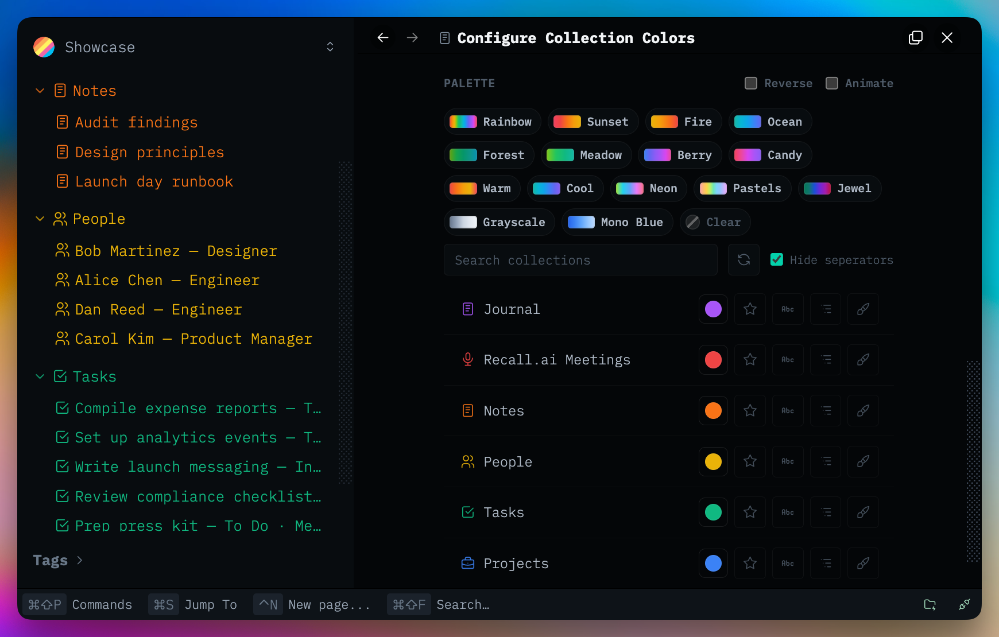

# Collection Colors

Global Thymer plugin that assigns colors to collections and applies those colors
across Thymer chrome.

Plugins are made with 🤍 for the Thymer community. Free to use, fork, and hack on for <a href="LICENSE" target="_blank" rel="noopener noreferrer">non-commercial use</a>.

Plug-ins take effort, hours, and credits to build. If you find them helpful for you and your workflows, a star ⭐ on the repo, a <a href="https://buymeacoffee.com/akaready" target="_blank" rel="noopener noreferrer">coffee</a> ☕, and a link back to <a href="https://akaready.com" target="_blank" rel="noopener noreferrer">@akaready</a> 🔗 all go a long way. Optional of course, but always appreciated.

Enjoy! 🙏

<p align="left">
  <a href="https://buymeacoffee.com/akaready" target="_blank" rel="noopener noreferrer">
    
  </a>
</p>



&nbsp;

## 📦 Install

**Recommended:** Use the [Thymer Plugins Manager](https://github.com/ahpatel/thymer-plugins-manager) and install via [this repo's URL](https://github.com/akaready/thymer-collection-colors) for auto updates.

**Manual:** copy <a href="plugin.js" target="_blank" rel="noopener noreferrer"><code>plugin.js</code></a> and <a href="plugin.json" target="_blank" rel="noopener noreferrer"><code>plugin.json</code></a> from this repo into Thymer's plugin editor.


&nbsp;

## ✨ What It Does

- Adds a settings panel: **Plugin: Collection Colors**.
- Lists workspace collections and lets the user choose a color per collection.
- Applies colors to sidebar collection titles, sidebar page items, breadcrumbs,
  and view labels depending on the selected targets.
- Supports built-in palettes, Tailwind shades, custom palettes, random colors,
  per-target variation controls, and light/dark previews.
- Shares its color map with other plugins through synced `plugin.json` custom
  JSON, with workspace-scoped localStorage as a local cache.


&nbsp;

## ⚙️ How It Works

This is an `AppPlugin`, not a per-collection plugin. On load it:

- injects the shared `shared/settings-ui` CSS plus Collection Colors-specific CSS;
- registers a custom settings panel with `this.ui.registerCustomPanelType`;
- adds a command palette entry that opens a single settings panel;
- loads collection data through the SDK and caches collection names/icons;
- writes CSS rules into a dedicated style element to tint Thymer DOM nodes;
- observes the sidebar so dynamically rendered rows get tagged and styled.

Synced data lives in `plugin.json`:

- `custom.colors`
- `custom.settings`

Local storage keys are scoped by workspace GUID and act as fast overrides:

- `collection-colors/<workspaceGuid>/colors`
- `collection-colors/<workspaceGuid>/settings`


&nbsp;

## 🧩 For Plugin Builders

Collection Colors is the **source of truth** for per-collection hues in a workspace. Other Thymer plugins can read the same color map and stay in sync when users change colors — no private API calls required.

**Prerequisite:** Collection Colors must be installed and configured. If it is missing or a collection has no color, treat that as “no tint” and keep your UI readable with Thymer defaults.

### Data contract

Colors are keyed by **collection GUID** (26-char base32, same as `data-guid` on `.sidebar-item-collection`).

**Synced source** — Collection Colors `plugin.json` → `custom.colors`:

```json
{
  "<collectionGuid>": {
    "color": "#3b82f6",
    "applyTo": "icon+text"
  }
}
```

- `color` — hex string (`#rrggbb`) or internal ramp tokens like `twflip:…`. For styling, use the hex; ramp tokens are Collection Colors–specific.
- `applyTo`, `sidebarTargets`, `breadcrumbTargets`, `titleVariation`, `pagesVariation` — optional per-collection overrides. Most consumer plugins only need `color`.

**Local cache** (updated immediately on picker changes, before sync commits):

```
localStorage["collection-colors/<workspaceGuid>/colors"]
```

Same shape as above. Prefer **localStorage first**, then merge/overlay `custom.colors` from the global plugin on load.

Global settings (defaults, variation, highlight behavior) live in `custom.settings` and `collection-colors/<workspaceGuid>/settings`. You usually do not need these unless you are matching Collection Colors’ title vs. pages split.

### Reading colors in your plugin

Minimal pattern (see also `plugins/collection-link-chips` in the monorepo):

```javascript
_colorsKey() {
  return `collection-colors/${this.getWorkspaceGuid()}/colors`;
}

_loadLocalObject(key) {
  try {
    const parsed = JSON.parse(localStorage.getItem(key) || '{}');
    return parsed && typeof parsed === 'object' ? parsed : {};
  } catch {
    return {};
  }
}

/** @returns {Record<string, string>} collectionGuid → CSS color */
_normalizeCollectionColors(raw) {
  /** @type {Record<string, string>} */
  const out = {};
  for (const [guid, entry] of Object.entries(raw || {})) {
    const color = entry && entry.color;
    if (typeof color === 'string' && color.startsWith('#')) out[guid] = color;
  }
  return out;
}

_loadCollectionColors() {
  return this._normalizeCollectionColors(this._loadLocalObject(this._colorsKey()));
}

async _refreshCollectionColorsFromConfig() {
  const plugins = await this.data.getAllGlobalPlugins();
  const cc = plugins.find((p) => p?.getName?.() === 'Collection Colors');
  const custom = cc?.getConfiguration?.()?.custom;
  this._colorsByGuid = {
    ...this._normalizeCollectionColors(custom?.colors || {}),
    ...this._loadCollectionColors(), // local wins for live edits
  };
}
```

Resolve a **record/page** color by walking to its parent collection GUID (your plugin may already maintain a `recordGuid → collectionGuid` map).

### Staying live

Listen for cross-tab/local updates while your plugin is loaded:

```javascript
window.addEventListener('storage', (event) => {
  if (event.key === this._colorsKey()) {
    this._colorsByGuid = this._loadCollectionColors();
    this._reapplyYourStyles();
  }
});
```

Also refresh from config on `onLoad`, and after collection/record move events if your DOM decorations depend on structure.

### DOM and CSS hooks

When Collection Colors is active it annotates Thymer’s live DOM so tint CSS can target collections reliably:

| Attribute | Where | Use |
|-----------|-------|-----|
| `data-plg-coll-sidebar="1"` | Sidebar root | Scope rules to an annotated sidebar |
| `data-plg-coll-guid="<collGuid>"` | Collection row, breadcrumb chip | Target a specific collection row |
| `data-coll-parent="<collGuid>"` | Child `.sidebar-item` rows under a collection | Target pages/items in that collection |
| `data-plg-coll-active="1"` | Open sidebar page (+ its collection when collapsed) | Highlight/focus styling |

Collection Colors writes rules into `#plg-collection-colors-tint`. **Do not modify that stylesheet.** Inject your own rules or inline styles using the hex values you read from storage.

**Important:** A record’s flat `data-guid` does **not** embed its parent collection GUID (except journal/nest prefixes). If you need “all items in collection X” and Collection Colors is not installed, you must walk the sidebar yourself and stamp `data-coll-parent` — copy the observer pattern in `plugin.js` (`_annotateSidebar`). If Collection Colors *is* installed, prefer its `data-coll-parent` attributes.

### Agent checklist

1. Read `collection-colors/<wsGuid>/colors` from `localStorage`; fall back to global plugin `custom.colors`.
2. Key everything by collection GUID; map records → collections in your plugin if needed.
3. Subscribe to `storage` on the colors key for live updates.
4. Degrade gracefully when Collection Colors is absent or a color is unset.
5. Scope DOM selectors to live app containers (`.sidebar`, `.panel-menubar-buttons`) — never bare `[data-guid]` selectors.
6. Reference implementation: <a href="https://github.com/akaready/thymer-plugins/tree/main/plugins/collection-link-chips" target="_blank" rel="noopener noreferrer">collection-link-chips</a> (`_colorsKey`, `_refreshCollectionColorsFromConfig`, `_onStorage`).


&nbsp;

## 📝 Important Implementation Notes

- Selector work is pinned to Thymer's current sidebar/breadcrumb DOM. Keep rules
  scoped to live app containers; do not use bare `[data-guid]` selectors.
- `saveConfiguration()` is debounced and equality-checked. Live slider/picker
  updates still go to CSS/local cache first so interaction stays smooth.
- Slider and picker interactions use live style updates first, then commit saved
  settings when the interaction ends.


&nbsp;

## 📊 Anonymous Usage Counter

This plugin pings a <a href="https://www.goatcounter.com/" target="_blank" rel="noopener noreferrer">privacy-respecting counter</a> on first install and once per day of active use. It exists so I can see which plugins are worth continuing to invest in — both "did anyone install it" and "is anyone still using it after a week." Combined with the coffee donations, this is what tells me whether to keep building. It tracks the plugin slug only, no other telemetry or user data, and you can see exactly what I see on the <a href="https://thymer-plugins.goatcounter.com" target="_blank" rel="noopener noreferrer">public dashboard</a>.

**Opt out:** Do Not Track, or `localStorage.setItem('tps-telemetry-opt-out','1')` in the console.
